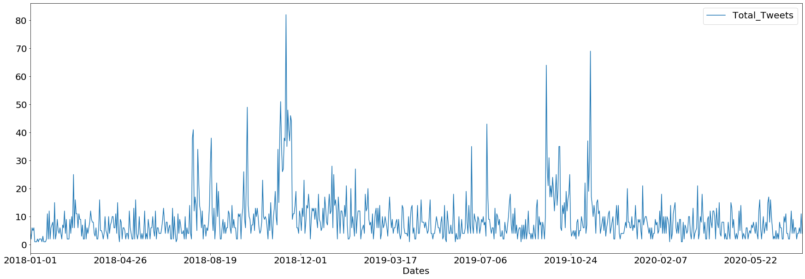

# Analisis #Gempa @infoBMKG
&nbsp;

Pada studi kasus ini kita akan menganalisa mengenai Gempa yang terjadi dari awal tahun 2018 sampai bulan 27 Juli 2020. Data ini bersumber dari akun twitter @infoBMKG yang diambil dengan kata kunci #Gempa. Tujuan dari analisa ini adalah agar dapat dimanfaatkannya limpahan Big Data yang bersumber dari twitter dengan fokus topik mengenai gempa. Dengan kita mengetahui wilayah mana saja yang pernah terjadi gempa, kita dapat melakukan mitigasi bencana pada wilayah - wilayah tersebut. 
 
Dalam proses analisis ini kita juga melakukan proses ETL (Extract Transfom Load), ekstrasi data dari twitter kemudian ditransform menjadi format baru sesuai keutuhan lalu disimpan dalam variabel yang telah ditentukan. File disimpan dalam format .csv kemudian dibaca dengan pandas agar dapat ditampilkan dalam bentuk dataframe. File tersebut berisi hasil scraping data dari akun twitter @infoBMKG.
&nbsp;
&nbsp;

<table class="dataframe">
  <thead>
    <tr style="text-align: right;">
      <th></th>
      <th>id</th>
      <th>conversation_id</th>
      <th>created_at</th>
      <th>date</th>
      <th>time</th>
      <th>timezone</th>
      <th>user_id</th>
      <th>username</th>
      <th>name</th>
      <th>place</th>
      <th>...</th>
      <th>geo</th>
      <th>source</th>
      <th>user_rt_id</th>
      <th>user_rt</th>
      <th>retweet_id</th>
      <th>reply_to</th>
      <th>retweet_date</th>
      <th>translate</th>
      <th>trans_src</th>
      <th>trans_dest</th>
    </tr>
  </thead>
  <tbody>
    <tr>
      <th>0</th>
      <td>1287560105999777793</td>
      <td>1287560105999777793</td>
      <td>1595813225000</td>
      <td>2020-07-27</td>
      <td>08:27:05</td>
      <td>WIB</td>
      <td>108543358</td>
      <td>infobmkg</td>
      <td>BMKG</td>
      <td>NaN</td>
      <td>...</td>
      <td>NaN</td>
      <td>NaN</td>
      <td>NaN</td>
      <td>NaN</td>
      <td>NaN</td>
      <td>[{'user_id': '108543358', 'username': 'infoBMK...</td>
      <td>NaN</td>
      <td>NaN</td>
      <td>NaN</td>
      <td>NaN</td>
    </tr>
    <tr>
      <th>1</th>
      <td>1287559797538136064</td>
      <td>1287559797538136064</td>
      <td>1595813152000</td>
      <td>2020-07-27</td>
      <td>08:25:52</td>
      <td>WIB</td>
      <td>108543358</td>
      <td>infobmkg</td>
      <td>BMKG</td>
      <td>NaN</td>
      <td>...</td>
      <td>NaN</td>
      <td>NaN</td>
      <td>NaN</td>
      <td>NaN</td>
      <td>NaN</td>
      <td>[{'user_id': '108543358', 'username': 'infoBMK...</td>
      <td>NaN</td>
      <td>NaN</td>
      <td>NaN</td>
      <td>NaN</td>
    </tr>
    <tr>
      <th>2</th>
      <td>1287510275810160640</td>
      <td>1287510275810160640</td>
      <td>1595801345000</td>
      <td>2020-07-27</td>
      <td>05:09:05</td>
      <td>WIB</td>
      <td>108543358</td>
      <td>infobmkg</td>
      <td>BMKG</td>
      <td>NaN</td>
      <td>...</td>
      <td>NaN</td>
      <td>NaN</td>
      <td>NaN</td>
      <td>NaN</td>
      <td>NaN</td>
      <td>[{'user_id': '108543358', 'username': 'infoBMK...</td>
      <td>NaN</td>
      <td>NaN</td>
      <td>NaN</td>
      <td>NaN</td>
    </tr>
    <tr>
      <th>3</th>
      <td>1287509492846845952</td>
      <td>1287509492846845952</td>
      <td>1595801158000</td>
      <td>2020-07-27</td>
      <td>05:05:58</td>
      <td>WIB</td>
      <td>108543358</td>
      <td>infobmkg</td>
      <td>BMKG</td>
      <td>NaN</td>
      <td>...</td>
      <td>NaN</td>
      <td>NaN</td>
      <td>NaN</td>
      <td>NaN</td>
      <td>NaN</td>
      <td>[{'user_id': '108543358', 'username': 'infoBMK...</td>
      <td>NaN</td>
      <td>NaN</td>
      <td>NaN</td>
      <td>NaN</td>
    </tr>
    <tr>
      <th>4</th>
      <td>1287397032592842753</td>
      <td>1287397032592842753</td>
      <td>1595774345000</td>
      <td>2020-07-26</td>
      <td>21:39:05</td>
      <td>WIB</td>
      <td>108543358</td>
      <td>infobmkg</td>
      <td>BMKG</td>
      <td>NaN</td>
      <td>...</td>
      <td>NaN</td>
      <td>NaN</td>
      <td>NaN</td>
      <td>NaN</td>
      <td>NaN</td>
      <td>[{'user_id': '108543358', 'username': 'infoBMK...</td>
      <td>NaN</td>
      <td>NaN</td>
      <td>NaN</td>
      <td>NaN</td>
    </tr>
  </tbody>
</table>

5 rows × 34 columns

&nbsp;

Detail kolom dari data frame di atas dapat dilihat di bawah ini. 

    Index(['id', 'conversation_id', 'created_at', 'date', 'time', 'timezone',
           'user_id', 'username', 'name', 'place', 'tweet', 'mentions', 'urls',
           'photos', 'replies_count', 'retweets_count', 'likes_count', 'hashtags',
           'cashtags', 'link', 'retweet', 'quote_url', 'video', 'near', 'geo',
           'source', 'user_rt_id', 'user_rt', 'retweet_id', 'reply_to',
           'retweet_date', 'translate', 'trans_src', 'trans_dest'],
          dtype='object')

## Preprocessing
 
Setelah data dapat diekstrak atau dibuka, data yang ada ditransform sesuai dengan kebutuhan analis. Pada tahap ini dipilah lagi tweet yang ada, kita hanya akan mengambil data tanggal pada kolom date, waktu pada kolom time, waktu wilayah pada kolom timezone dan tweet pada kolom tweet, tweet yang diambil hanya tweet yang menginformasikan gempa. Untuk mengetahuinya kita dapat melihat pada tweet apakah ada kalimat '#Gempa Mag:' yang menandakan tweet tersebut menginformasikan kejadian mengenai gempa.

             Date      Time Timezone                                               Tweet
    0  2020-07-27  08:27:05      WIB   #Gempa Mag:5, 27/07/2020 05:01:23 (Pusat gempa...
    1  2020-07-27  08:25:52      WIB   #Gempa Mag:5.0, 27-Jul-20 05:01:23 WIB, Lok:0....
    2  2020-07-27  05:09:05      WIB   #Gempa Mag:5.0, 27-Jul-20 05:01:23 WIB, Lok:0....
    3  2020-07-27  05:05:58      WIB   #Gempa Mag:5.0, 27-Jul-20 05:01:23 WIB, Lok:0....
    4  2020-07-26  21:39:05      WIB   #Gempa Mag:3.2, 26/07/2020 21:18:14 (Pusat gem...

&nbsp;

Data teks dari kolom tweet kita ambil untuk kita pilah kembali untuk menemukan tweet yang berkaitan dengan pemberitaan gempa bumi yang terjadi, karena belum tentu tweet yang mengandung #Gempa itu memberitakan bencana gempa bisa saja memberitakan informasi tentang apa itu gempa? atau klarifikasi berita gempa. Dalam proses ini kita mencari kalimat "#Gempa Mag:" apabila ada kalimat tersebut maka tweet tersebut memberitakan gempa bumi yang terjadi.
 
 
Selain itu kita juga akan menambah kolom "Area" yang berisi informasi dimana gempa terjadi.

## Visualisasi dan Analisa

Data yang sudah melalui tahap preprocessing akan menghasilkan seperti tabel di bawah ini. Di sini terdapat 5 kolom yaitu Date yang berisi tanggal tweet dipublish, Time yang berisi waktu tweet dipublish, Timezone, zona waktu untuk Time, Magnitudo dan Area

<table class="dataframe">
  <thead>
    <tr style="text-align: right;">
      <th></th>
      <th>Date</th>
      <th>Time</th>
      <th>Timezone</th>
      <th>Magnitudo</th>
      <th>Area</th>
    </tr>
  </thead>
  <tbody>
    <tr>
      <th>0</th>
      <td>2020-07-27</td>
      <td>08:27:05</td>
      <td>WIB</td>
      <td>5.0</td>
      <td>Pusat gempa di laut 89 km Timur Laut Nias Sela...</td>
    </tr>
    <tr>
      <th>1</th>
      <td>2020-07-27</td>
      <td>08:25:52</td>
      <td>WIB</td>
      <td>5.0</td>
      <td>Pusat gempa berada di laut 89 km Timur Laut Ni...</td>
    </tr>
    <tr>
      <th>2</th>
      <td>2020-07-27</td>
      <td>05:09:05</td>
      <td>WIB</td>
      <td>5.0</td>
      <td>89 km TimurLaut NIASSELATAN-SUMUT, Kedalaman:1...</td>
    </tr>
    <tr>
      <th>3</th>
      <td>2020-07-27</td>
      <td>05:05:58</td>
      <td>WIB</td>
      <td>5.0</td>
      <td>89 km TimurLaut NIASSELATAN-SUMUT, Kedlmn:10 K...</td>
    </tr>
    <tr>
      <th>4</th>
      <td>2020-07-26</td>
      <td>21:39:05</td>
      <td>WIB</td>
      <td>3.2</td>
      <td>Pusat gempa di laut 22 km Barat Laut Lembata, ...</td>
    </tr>
  </tbody>
</table>

 

<table class="dataframe">
  <thead>
    <tr style="text-align: right;">
      <th></th>
      <th>Total_Tweets</th>
    </tr>
    <tr>
      <th>Date</th>
      <th></th>
    </tr>
  </thead>
  <tbody>
    <tr>
      <th>2018-01-01</th>
      <td>5</td>
    </tr>
    <tr>
      <th>2018-01-03</th>
      <td>2</td>
    </tr>
    <tr>
      <th>2018-01-04</th>
      <td>6</td>
    </tr>
    <tr>
      <th>2018-01-05</th>
      <td>5</td>
    </tr>
    <tr>
      <th>2018-01-06</th>
      <td>6</td>
    </tr>
  </tbody>
</table>

 
    5 Tweet Tertinggi 
    
                Total_Tweets
    Date                    
    2018-11-15            82
    2019-11-15            69
    2019-09-26            64
    2018-11-09            51
    2018-10-02            49 
    
    Total hari 	:  858 
    
    Banyak Tweet 	:  7504 
    

Selama 858 hari BMKG melakukan tweet sebanyak 7504 tweet mengenai #Gempa, jumlah tweet terbanyak terjadi pada tanggal 15 November 2018 yaitu sebanyak 82 Tweet. 
  
 
Di bawah merupakan grafik garis frekuensi tweet setiap harinya selama periode Januari 2018 sampai 27 Juli 2020

&nbsp;
Dari keseluruhan data didapat rata - rata, median dan modulus sebesar :

    mean    : 4.323960554370998
    median  : 4.5
    mode    : 5.0
    dtype   : float64

Data yang ditampilkan pada tabel berikut merupakan gempa yang terjadi dengan kekuatan 7 skala richter ke atas. Jika dilihat tempat yang pernah dilanda gempa 7 skala richter ke atas rata - rata terjadi pada wilayah Indonesia bagian Timur, tapi bukan berarti wilayah lain aman dari bencana gempa bumi.

 
<table class="dataframe">
  <thead>
    <tr style="text-align: right;">
      <th></th>
      <th>Date</th>
      <th>Time</th>
      <th>Timezone</th>
      <th>Magnitudo</th>
      <th>Area</th>
    </tr>
  </thead>
  <tbody>
    <tr>
      <th>45</th>
      <td>2020-07-17</td>
      <td>10:03:04</td>
      <td>WIB</td>
      <td>7.3</td>
      <td>192 km TimurLaut PORTMORESBY-PNG, Kedalaman:87...</td>
    </tr>
    <tr>
      <th>46</th>
      <td>2020-07-17</td>
      <td>10:01:18</td>
      <td>WIB</td>
      <td>7.3</td>
      <td>192 km TimurLaut PORTMORESBY-PNG, Kedlmn:87 Km...</td>
    </tr>
    <tr>
      <th>296</th>
      <td>2020-06-04</td>
      <td>16:18:05</td>
      <td>WIB</td>
      <td>7.1</td>
      <td>Pusat gempa di laut 89 km BaratLaut Daruba, Ke...</td>
    </tr>
    <tr>
      <th>297</th>
      <td>2020-06-04</td>
      <td>15:57:05</td>
      <td>WIB</td>
      <td>7.1</td>
      <td>89 km BaratLaut DARUBA-MALUT, Kedalaman:112 Km...</td>
    </tr>
    <tr>
      <th>298</th>
      <td>2020-06-04</td>
      <td>15:54:25</td>
      <td>WIB</td>
      <td>7.1</td>
      <td>89 km BaratLaut DARUBA-MALUT, Kedlmn:112 Km, t...</td>
    </tr>
    <tr>
      <th>442</th>
      <td>2020-05-06</td>
      <td>21:00:05</td>
      <td>WIB</td>
      <td>7.3</td>
      <td>180 km BaratLaut MALUKUTENGGARABRT, Kedalaman:...</td>
    </tr>
    <tr>
      <th>443</th>
      <td>2020-05-06</td>
      <td>20:59:20</td>
      <td>WIB</td>
      <td>7.3</td>
      <td>180 km BaratLaut MALUKUTENGGARABRT, Kedlmn:133...</td>
    </tr>
    <tr>
      <th>1708</th>
      <td>2019-11-15</td>
      <td>00:06:22</td>
      <td>WIB</td>
      <td>7.4</td>
      <td>Pusat gempa berada dilaut 134 BaratLaut Jailol...</td>
    </tr>
    <tr>
      <th>1709</th>
      <td>2019-11-15</td>
      <td>00:06:09</td>
      <td>WIB</td>
      <td>7.4</td>
      <td>Pusat gempa dilaut 134 BaratLaut Jailolo, Kedl...</td>
    </tr>
    <tr>
      <th>1710</th>
      <td>2019-11-14</td>
      <td>23:36:10</td>
      <td>WIB</td>
      <td>7.1</td>
      <td>137 km BaratLaut JAILOLO-MALUT, Kedalaman:73 K...</td>
    </tr>
    <tr>
      <th>1711</th>
      <td>2019-11-14</td>
      <td>23:27:11</td>
      <td>WIB</td>
      <td>7.4</td>
      <td>134 km BaratLaut JAILOLO-MALUT, Kedalaman:10 K...</td>
    </tr>
    <tr>
      <th>2766</th>
      <td>2019-08-02</td>
      <td>19:13:42</td>
      <td>WIB</td>
      <td>7.4</td>
      <td>147 km BaratDaya SUMUR-BANTEN, Kedalaman:10 Km...</td>
    </tr>
    <tr>
      <th>2767</th>
      <td>2019-08-02</td>
      <td>19:09:30</td>
      <td>WIB</td>
      <td>7.4</td>
      <td>147 km BaratDaya SUMUR-BANTEN, Kedalaman:10 Km...</td>
    </tr>
    <tr>
      <th>2925</th>
      <td>2019-07-14</td>
      <td>16:36:12</td>
      <td>WIB</td>
      <td>7.2</td>
      <td>Pusat gempa di darat 62km TimurLaut Labuha, Ke...</td>
    </tr>
    <tr>
      <th>2926</th>
      <td>2019-07-14</td>
      <td>16:36:12</td>
      <td>WIB</td>
      <td>7.2</td>
      <td>Pusat gempa berada di darat 62km TimurLaut Lab...</td>
    </tr>
    <tr>
      <th>2929</th>
      <td>2019-07-14</td>
      <td>16:18:08</td>
      <td>WIB</td>
      <td>7.2</td>
      <td>62 km TimurLaut LABUHA-MALUT, Kedalaman:10 Km,...</td>
    </tr>
    <tr>
      <th>2930</th>
      <td>2019-07-14</td>
      <td>16:15:44</td>
      <td>WIB</td>
      <td>7.2</td>
      <td>62 km TimurLaut LABUHA-MALUT, Kedlmn:10 Km, td...</td>
    </tr>
    <tr>
      <th>2969</th>
      <td>2019-07-07</td>
      <td>23:03:19</td>
      <td>WIB</td>
      <td>7.1</td>
      <td>Pusat gempa berada di laut 136 km Barat Daya T...</td>
    </tr>
    <tr>
      <th>2970</th>
      <td>2019-07-07</td>
      <td>23:03:08</td>
      <td>WIB</td>
      <td>7.1</td>
      <td>Pusat gempa di laut 136 km Barat Daya Ternate,...</td>
    </tr>
    <tr>
      <th>2971</th>
      <td>2019-07-07</td>
      <td>22:24:07</td>
      <td>WIB</td>
      <td>7.0</td>
      <td>133 km BaratDaya TERNATE-MALUT, Kedalaman:36 K...</td>
    </tr>
    <tr>
      <th>2972</th>
      <td>2019-07-07</td>
      <td>22:21:10</td>
      <td>WIB</td>
      <td>7.1</td>
      <td>135 km BaratDaya TERNATE-MALUT, Kedalaman:10 K...</td>
    </tr>
    <tr>
      <th>2973</th>
      <td>2019-07-07</td>
      <td>22:14:01</td>
      <td>WIB</td>
      <td>7.1</td>
      <td>136 km BaratDaya TERNATE-MALUT, Kedlmn:10 Km, ...</td>
    </tr>
    <tr>
      <th>3068</th>
      <td>2019-06-24</td>
      <td>10:00:08</td>
      <td>WIB</td>
      <td>7.7</td>
      <td>245 km TimurLaut MALUKUBRTDAYA, Kedalaman:231 ...</td>
    </tr>
    <tr>
      <th>3069</th>
      <td>2019-06-24</td>
      <td>09:58:07</td>
      <td>WIB</td>
      <td>7.7</td>
      <td>245 km TimurLaut MALUKUBRTDAYA, Kedlmn:231 Km,...</td>
    </tr>
    <tr>
      <th>4396</th>
      <td>2018-12-29</td>
      <td>12:59:02</td>
      <td>WIB</td>
      <td>7.1</td>
      <td>Pusat gempa berada di laut Mindanao - Philipin...</td>
    </tr>
    <tr>
      <th>5832</th>
      <td>2018-09-28</td>
      <td>17:09:11</td>
      <td>WIB</td>
      <td>7.7</td>
      <td>27 km TimurLaut DONGGALA-SULTENG, Kedalaman:10...</td>
    </tr>
    <tr>
      <th>6321</th>
      <td>2018-08-05</td>
      <td>19:46:09</td>
      <td>WIB</td>
      <td>7.0</td>
      <td>Pusat gempa di darat 18 km Barat Laut Lombok T...</td>
    </tr>
    <tr>
      <th>6322</th>
      <td>2018-08-05</td>
      <td>19:36:10</td>
      <td>WIB</td>
      <td>7.0</td>
      <td>Pusat gempa di darat 18 km Barat Laut Lombok T...</td>
    </tr>
    <tr>
      <th>7279</th>
      <td>2018-02-26</td>
      <td>01:31:11</td>
      <td>WIB</td>
      <td>7.6</td>
      <td>Pusat gempa di darat 266 km tenggara Bovendigo...</td>
    </tr>
    <tr>
      <th>7280</th>
      <td>2018-02-26</td>
      <td>01:29:42</td>
      <td>WIB</td>
      <td>7.6</td>
      <td>Pusat gempa berada di darat 266 km tenggara Bo...</td>
    </tr>
    <tr>
      <th>7283</th>
      <td>2018-02-26</td>
      <td>00:52:11</td>
      <td>WIB</td>
      <td>7.6</td>
      <td>266 km Tenggara BOVENDIGOEL-PAPUA, Kedlmn:96 K...</td>
    </tr>
    <tr>
      <th>7284</th>
      <td>2018-02-26</td>
      <td>00:51:10</td>
      <td>WIB</td>
      <td>7.6</td>
      <td>266 km Tenggara BOVENDIGOEL-PAPUA, Kedlmn:96 Km</td>
    </tr>
  </tbody>
</table>

    array([['2020-07-17', '10:03:04', 'WIB', 7.3,
            '192 km TimurLaut PORTMORESBY-PNG, Kedalaman:87 Km, tidak berpotensi tsunami '],
           ['2020-07-17', '10:01:18', 'WIB', 7.3,
            '192 km TimurLaut PORTMORESBY-PNG, Kedlmn:87 Km, tdk berpotensi tsunami '],
           ['2020-06-04', '16:18:05', 'WIB', 7.1,
            'Pusat gempa di laut 89 km BaratLaut Daruba, Kedlmn:112 Km Dirasakan ,MMI IV Morotai, II-III Manado, II-III Bitung, II-III Minahasa, II-III Ternate, II-III Sitaro, II-III Tahuna, II-III Talaud, II-III Bolaang Mongondow , '],
           ['2020-06-04', '15:57:05', 'WIB', 7.1,
            '89 km BaratLaut DARUBA-MALUT, Kedalaman:112 Km, tidak berpotensi tsunami '],
           ['2020-06-04', '15:54:25', 'WIB', 7.1,
            '89 km BaratLaut DARUBA-MALUT, Kedlmn:112 Km, tdk berpotensi tsunami '],
           ['2020-05-06', '21:00:05', 'WIB', 7.3,
            '180 km BaratLaut MALUKUTENGGARABRT, Kedalaman:133 Km, tidak berpotensi tsunami '],
           ['2020-05-06', '20:59:20', 'WIB', 7.3,
            '180 km BaratLaut MALUKUTENGGARABRT, Kedlmn:133 Km, tdk berpotensi tsunami '],
           ['2019-11-15', '00:06:22', 'WIB', 7.4,
            'Pusat gempa berada dilaut 134 BaratLaut Jailolo, Kedlmn:10 Km Dirasakan ,MMI IV-V Bitung, IV-V Manado, III-IV Gorontalo, III-IV Ternate, II Buol '],
           ['2019-11-15', '00:06:09', 'WIB', 7.4,
            'Pusat gempa dilaut 134 BaratLaut Jailolo, Kedlmn:10 Km Dirasakan ,MMI IV-V Bitung, IV-V Manado, III-IV Gorontalo, III-IV Ternate, II Buol, '],
           ['2019-11-14', '23:36:10', 'WIB', 7.1,
            '137 km BaratLaut JAILOLO-MALUT, Kedalaman:73 Km, Potensi tsunami utk dtrskn pd msyrkt '],
           ['2019-11-14', '23:27:11', 'WIB', 7.4,
            '134 km BaratLaut JAILOLO-MALUT, Kedalaman:10 Km, Potensi tsunami utk dtrskn pd msyrkt '],
           ['2019-08-02', '19:13:42', 'WIB', 7.4,
            '147 km BaratDaya SUMUR-BANTEN, Kedalaman:10 Km, Potensi tsunami utk dtrskn pd msyrkt '],
           ['2019-08-02', '19:09:30', 'WIB', 7.4,
            '147 km BaratDaya SUMUR-BANTEN, Kedalaman:10 Km, Potensi tsunami utk dtrskn pd msyrkt '],
           ['2019-07-14', '16:36:12', 'WIB', 7.2,
            'Pusat gempa di darat 62km TimurLaut Labuha, Kedlmn:10 Km Dirasakan ,MMI V Obi, III Labuha, II-III Manado, II-III Ambon, II Ternate, II Namlea, II Gorontalo, II Sorong, II Bolang Mongondow, '],
           ['2019-07-14', '16:36:12', 'WIB', 7.2,
            'Pusat gempa berada di darat 62km TimurLaut Labuha, Kedlmn:10 Km Dirasakan ,MMI V Obi, III Labuha, II-III Manado, II-III Ambon, II Ternate, II Namlea, II Gorontalo, II Sorong, II Bolang Mongondow '],
           ['2019-07-14', '16:18:08', 'WIB', 7.2,
            '62 km TimurLaut LABUHA-MALUT, Kedalaman:10 Km, tidak berpotensi tsunami '],
           ['2019-07-14', '16:15:44', 'WIB', 7.2,
            '62 km TimurLaut LABUHA-MALUT, Kedlmn:10 Km, tdk berpotensi tsunami '],
           ['2019-07-07', '23:03:19', 'WIB', 7.1,
            'Pusat gempa berada di laut 136 km Barat Daya Ternate, Kedlmn:10 Km Dirasakan ,MMI IV-V Bitung, IV-V Manado, III-IV Ternate '],
           ['2019-07-07', '23:03:08', 'WIB', 7.1,
            'Pusat gempa di laut 136 km Barat Daya Ternate, Kedlmn:10 Km Dirasakan ,MMI IV-V Bitung, IV-V Manado, III-IV Ternate, '],
           ['2019-07-07', '22:24:07', 'WIB', 7.0,
            '133 km BaratDaya TERNATE-MALUT, Kedalaman:36 Km, Potensi tsunami utk dtrskn pd msyrkt '],
           ['2019-07-07', '22:21:10', 'WIB', 7.1,
            '135 km BaratDaya TERNATE-MALUT, Kedalaman:10 Km, Potensi tsunami utk dtrskn pd msyrkt '],
           ['2019-07-07', '22:14:01', 'WIB', 7.1,
            '136 km BaratDaya TERNATE-MALUT, Kedlmn:10 Km, tdk berpotensi tsunami '],
           ['2019-06-24', '10:00:08', 'WIB', 7.7,
            '245 km TimurLaut MALUKUBRTDAYA, Kedalaman:231 Km, tidak berpotensi tsunami '],
           ['2019-06-24', '09:58:07', 'WIB', 7.7,
            '245 km TimurLaut MALUKUBRTDAYA, Kedlmn:231 Km, tdk berpotensi tsunami '],
           ['2018-12-29', '12:59:02', 'WIB', 7.1,
            'Pusat gempa berada di laut Mindanao - Philipina, Kedlmn:69 Km Dirasakan ,MMI IV Talaud, III-IV Tahuna, III- IV Sangihe, III Siau Sitaro, III Tobelo, III Morotai , II Manado, II Ternate, II Jailolo '],
           ['2018-09-28', '17:09:11', 'WIB', 7.7,
            '27 km TimurLaut DONGGALA-SULTENG, Kedalaman:10 Km, Potensi tsunami utk dtrskn pd msyrkt '],
           ['2018-08-05', '19:46:09', 'WIB', 7.0,
            'Pusat gempa di darat 18 km Barat Laut Lombok Timur, Kedlmn:15 Km Dirasakan ,MMI III Waingapu, II Sawahan, II-III Banyuwangi, V-VI Denpasar, IV Kuta, II-III Situbondo, V-VI Karangasem, V-VI Bima, II-III Malang, VII Mataram, '],
           ['2018-08-05', '19:36:10', 'WIB', 7.0,
            'Pusat gempa di darat 18 km Barat Laut Lombok Timur, Kedlmn:15 Km Dirasakan ,MMI III Waingapu, II Sawahan, II-III Banyuwangi, V-VI Denpasar, IV Kuta, II-III Situbondo, V-VI Karangasem, V-VI Bima, II-III Malang, '],
           ['2018-02-26', '01:31:11', 'WIB', 7.6,
            'Pusat gempa di darat 266 km tenggara Bovendigoel, Kedlmn:96 Km Dirasakan ,MMI IV-V Tanah Merah, IV-V Wamena, IV-V Merauke, II-III Jayapura, '],
           ['2018-02-26', '01:29:42', 'WIB', 7.6,
            'Pusat gempa berada di darat 266 km tenggara Bovendigoel, Kedlmn:96 Km Dirasakan ,MMI IV-V Tanah Merah, IV-V Wamena, IV-V Merauke, II-III Jayapura '],
           ['2018-02-26', '00:52:11', 'WIB', 7.6,
            '266 km Tenggara BOVENDIGOEL-PAPUA, Kedlmn:96 Km, tdk berpotensi tsunami '],
           ['2018-02-26', '00:51:10', 'WIB', 7.6,
            '266 km Tenggara BOVENDIGOEL-PAPUA, Kedlmn:96 Km ']], dtype=object)

