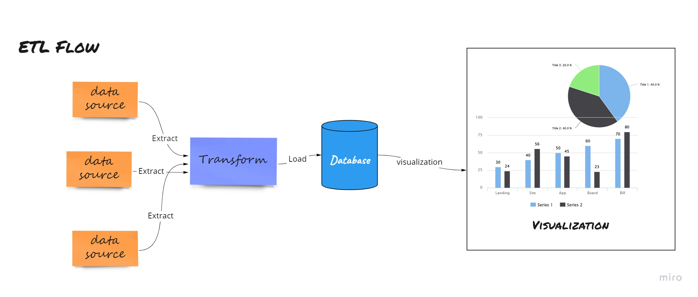

# Extract Transform Load



*Extract Transform Load* atau yang disingkat ETL, yang merupakan proses pengambilan data dari banyak sumber untuk disimpan pada satu penyimpanan atau biasa disebut *data warehouse*. ETL ini merupakan bagian dasar dalam hal pengolahan data, sesuai dengan namanya terdapat tiga proses yang dilakukan. 

Dalam *project* ini kita akan coba lakukan pengambilan data dari dua sumber, yang pertama pengambilan data harga emas kemudian yang kedua data cuaca. 

(Memang ada hubungannya harga emas sama data cuaca?)


```python
# import lib yang dibutuhkan
import requests as req #for request
from bs4 import BeautifulSoup #for html scraping
import pandas as pd #for dataframe
```

# Scraping Harga Emas


```python
# Ekstrak Data
startDate = '2015-01-01'
endDate = '2022-03-20'
web = req.get('https://pusatdata.kontan.co.id/market/chart_logam_mulia/?startdate='+startDate+'&enddate='+endDate+'&logam=gold')
```

Data emas yang kita akan ambil berasal dari https://pusatdata.kontan.co.id dengan rentang waktu 01 Januari 2015 sampai 20 Maret 2022, untuk tanggalnya sendiri kita masukan ke dalam variabel agar mudah diubah.


```python
soup = BeautifulSoup(web.content, 'html.parser')
soup
```

``` html

     <div class="sec-pane">
    <div class="clear-all high-25"></div>
    <div class="myDivo" id="congenab">
    <canvas id="line-chart" style="width:100%; height:420px;"></canvas>
    <script>
              var tanggal = new Array();
                            tanggal.push('2015-01-02');
                            tanggal.push('2015-01-05');
                            tanggal.push('2015-01-06');
                            tanggal.push('2015-01-07');
                          . . .
    </div>
    <div class="tabel-body">
    <div class="kol-konten3-1">05/01/2015</div>
    <div class="kol-konten3-2"><div class="w-30-px txtleft">GOLD</div></div>
    <div class="kol-konten3-3">Rp 485.000</div>
    </div>
    <div class="tabel-body">
    <div class="kol-konten3-1">02/01/2015</div>
    <div class="kol-konten3-2"><div class="w-30-px txtleft">BUYBACK</div></div>
    <div class="kol-konten3-3">Rp 473.000</div>
    </div>
    <div class="tabel-body">
    <div class="kol-konten3-1">02/01/2015</div>
    <div class="kol-konten3-2"><div class="w-30-px txtleft">GOLD</div></div>
    <div class="kol-konten3-3">Rp 485.000</div>
    </div>
    </div>
    <p><strong>Keterangan:</strong> <br/>Logam Mulia menjual emas dan perak batangan dalam beberapa ukuran berat (misalnya 1 gram, 2 gram, dan 500 gram). Biasanya harga per gram akan berbeda tergantung berat batangnya. Perbedaan ini terjadi karena ada biaya tambahan untuk pencetakan, sehingga harga per gram batang kecil lebih mahal dari batang yang lebih besar. Harga yang ada di sini adalah harga per gram emas batang 1 kilogram yang biasa dijadikan patokan pelaku bisnis emas.</p>
```


Bagian pertama yang dilakukan adalah *Ekstract* yaitu proses pengambilan data mentah dari sumber data. 

Pada Bagian Ekstrak ini kita menggunakan lib BeautifulSoup yang merupakan bagian dari bs4. Setelah kita get kita mendapatkan response html seperti di atas. Dari html itulah akan kita ambil konten yang kita inginkan.


```python
# Transaform Data
tanggal = []
keterangan = []
harga = []
body = soup.find_all(class_='tabel-body')
for x in body:
    tanggal.append(x.find(class_='kol-konten3-1').get_text())
    keterangan.append(x.find(class_='kol-konten3-2').get_text())
    harga.append(x.find(class_='kol-konten3-3').get_text())
```

Untuk pengambilannya sendiri kita bisa mengandalkan nama class atau id pada html yang ada. Jika ingin mengambil konten dari nama class yang sama kita pakai .find_all kemudian kita looping untuk diambil html dan konten yang ada di dalam class tersebut. Jika classnya hanya satu kita pakai .find hal itu akan mengambil satu tag hmtl (jika di dalamnya ada html lagi maka html tersebut akan ikut terambil). Untuk mengambil text atau konten kita bisa menggunakan get_text().


```python
data = {
    "Tanggal":tanggal,
    "Keterangan":keterangan,
    "Harga":harga
}
df = pd.DataFrame(data=data)
```


```python
df.head()
```


<div>
<style scoped>
    .dataframe tbody tr th:only-of-type {
        vertical-align: middle;
    }

    .dataframe tbody tr th {
        vertical-align: top;
    }

    .dataframe thead th {
        text-align: right;
    }
</style>
<table border="1" class="dataframe">
  <thead>
    <tr style="text-align: right;">
      <th></th>
      <th>Tanggal</th>
      <th>Keterangan</th>
      <th>Harga</th>
    </tr>
  </thead>
  <tbody>
    <tr>
      <th>0</th>
      <td>20/03/2022</td>
      <td>BUYBACK</td>
      <td>Rp 887.000</td>
    </tr>
    <tr>
      <th>1</th>
      <td>19/03/2022</td>
      <td>BUYBACK</td>
      <td>Rp 887.000</td>
    </tr>
    <tr>
      <th>2</th>
      <td>19/03/2022</td>
      <td>GOLD</td>
      <td>Rp 984.000</td>
    </tr>
    <tr>
      <th>3</th>
      <td>18/03/2022</td>
      <td>BUYBACK</td>
      <td>Rp 894.000</td>
    </tr>
    <tr>
      <th>4</th>
      <td>18/03/2022</td>
      <td>GOLD</td>
      <td>Rp 991.000</td>
    </tr>
  </tbody>
</table>
</div>


Jika data sudah didapat kita bisa menyesuaikan sesuai keinginan kita proses ini disebut *Transform*, bisa kita ubah ke dataframe seperti format di atas, bisa json atau hanya array biasa. Dalam bagian ini data disampan ke dataframe agar nantinya bisa di load ke csv.


```python
# Load Data
df.to_csv('hargaEmas_'+startDate+'_'+endDate+'.csv')
```

Dataframe sudah jadi dan data sudah bisa diload ke csv. Setelah data berhasil diload data dapat didistribusikan :sunglasses:

# Scraping Data Cuaca


```python
# kita import lib tambahan untuk bagian cuaca ini
import xmltodict # lib ini untuk mengubah xml menjadi dict
import json # lib ini untuk mengolah json
```


```python
# Ekstrak Data
cuaca = req.get('https://data.bmkg.go.id/DataMKG/MEWS/DigitalForecast/DigitalForecast-DIYogyakarta.xml')
dataCuaca = xmltodict.parse(cuaca.content,attr_prefix='')
dictCuaca = json.dumps(dataCuaca)
dictCuaca = json.loads(dictCuaca)
```

Data cuaca kita ambil langsung dari Open *API* milik BMKG. *Response* dari *API* berbentuk xml dan kita ubah ke dalam json.


```python
dt = dictCuaca['data']['forecast']
```


```python
def kamus_cuaca():
    cuaca = {
        0 : "Cerah",
        1 : "Cerah Berawan",
        2 : "Cerah Berawan",
        3 : "Berawan",
        4 : "Berawan Tebal",
        100 : "Cerah",
        101 : "Cerah Berawan",
        102 : "Cerah Berawan",
        103 : "Berawan",
        104 : "Berawan Tebal",
        5 : "Udara Kabur",
        10 : "Asap",
        45 : "Kabut",
        60 : "Hujan Ringan",
        61 : "Hujan Sedang",
        63 : "Hujan Lebat",
        80 : "Hujan Lokal",
        95 : "Hujan Petir",
        97 : "Hujan Petir"
    }
    return cuaca
```

Kita buat fungsi yang di dalamnya memuat kode cuaca, ini kita pakai untuk konversi data dari kode menjadi kalimat yang mudah dibaca oleh *user*


```python
# Transfrom
dCuaca = kamus_cuaca() # panggil fungsi yang sudah dibuat sebelumnya
_data = []
for i in dt['area']:
    x =  i['domain']
    weather = []
    area = {
            'source': 'BMKG (Badan Meteorologi, Klimatologi, dan Geofisika)',
            'id': i['id'],
            'latitude': i['latitude'],
            'longitude': i['longitude'],
            'coordinate': i['coordinate'],
            'kabupaten': i['description'],
            'propinsi': i['domain'],
            'waktu': dt['issue']
    } # kita buat dict atau objek untuk menyimpan data yang diinginkan
    for x in i['parameter']:
        if x['id'] == 'weather':
            for y in x['timerange']:
                kd = y['value']['#text']
                ketCuaca = dCuaca[int(kd)] # keterangan cuaca kita konversi di sini
                y['value']['#text'] = ketCuaca
                weather.append(y)
    temp = { 'weather':weather}    
    area.update(temp) # obejek atau dict ditambahkan dengan array weather di atas
    _data.append(area)
```


```python
_data
```
```json
  _data =  [{'source': 'BMKG (Badan Meteorologi, Klimatologi, dan Geofisika)',
      'id': '501186',
      'latitude': '-7.916666669',
      'longitude': '110.3167',
      'coordinate': '110.3167 -7.916666669',
      'kabupaten': 'Bantul',
      'propinsi': 'DI Yogyakarta',
      'waktu': {'timestamp': '20220322030146',
       'year': '2022',
       'month': '03',
       'day': '22',
       'hour': '03',
       'minute': '01',
       'second': '46'},
      'weather': [{'type': 'hourly',
        'h': '0',
        'datetime': '202203220000',
        'value': {'unit': 'icon', '#text': 'Cerah Berawan'}},
       {'type': 'hourly',
        'h': '6',
        'datetime': '202203220600',
        'value': {'unit': 'icon', '#text': 'Berawan Tebal'}},
       {'type': 'hourly',
        'h': '12',
        'datetime': '202203221200',
        'value': {'unit': 'icon', '#text': 'Hujan Ringan'}},
       {'type': 'hourly',
        'h': '18',
        'datetime': '202203221800',
        'value': {'unit': 'icon', '#text': 'Hujan Ringan'}},
       {'type': 'hourly',
        'h': '24',
        'datetime': '202203230000',
        'value': {'unit': 'icon', '#text': 'Berawan'}},
       {'type': 'hourly',
        'h': '30',
        'datetime': '202203230600',
        'value': {'unit': 'icon', '#text': 'Berawan Tebal'}},
       {'type': 'hourly',
        'h': '36',
        'datetime': '202203231200',
        'value': {'unit': 'icon', '#text': 'Berawan'}},
       {'type': 'hourly',
        'h': '42',
        'datetime': '202203231800',
        'value': {'unit': 'icon', '#text': 'Berawan'}},
       {'type': 'hourly',
        'h': '48',
        'datetime': '202203240000',
        'value': {'unit': 'icon', '#text': 'Berawan'}},
       {'type': 'hourly',
        'h': '54',
        'datetime': '202203240600',
        'value': {'unit': 'icon', '#text': 'Berawan'}},
       {'type': 'hourly',
        'h': '60',
        'datetime': '202203241200',
        'value': {'unit': 'icon', '#text': 'Hujan Ringan'}},
       {'type': 'hourly',
        'h': '66',
        'datetime': '202203241800',
        'value': {'unit': 'icon', '#text': 'Hujan Ringan'}}]},
    }]
```


```python
# Proses Transform untuk mengelompokan data cuaca setiap Kabupaten kemudian dilihat setiap 6 jam
kabupaten = []
waktu = []
cuaca = []
jam = []
for d in _data:
    print(d['kabupaten'])
    for w in d['weather']:
        kabupaten.append(d['kabupaten'])
        waktu.append(d['waktu']['year']+'/'+d['waktu']['month']+'/'+d['waktu']['day']+' '+d['waktu']['hour']+':'+d['waktu']['minute'])
        print('Hours: '+w['h']+' - '+w['value']['#text'])
        jam.append(w['h'])
        cuaca.append(w['value']['#text'])
    print()
```

    Bantul
    Hours: 0 - Cerah Berawan
    Hours: 6 - Berawan Tebal
    Hours: 12 - Hujan Ringan
    Hours: 18 - Hujan Ringan
    Hours: 24 - Berawan
    Hours: 30 - Berawan Tebal
    Hours: 36 - Berawan
    Hours: 42 - Berawan
    Hours: 48 - Berawan
    Hours: 54 - Berawan
    Hours: 60 - Hujan Ringan
    Hours: 66 - Hujan Ringan
    
    Sleman
    Hours: 0 - Cerah Berawan
    Hours: 6 - Hujan Lebat
    Hours: 12 - Berawan Tebal
    Hours: 18 - Berawan
    Hours: 24 - Berawan
    Hours: 30 - Hujan Petir
    Hours: 36 - Hujan Ringan
    Hours: 42 - Berawan
    Hours: 48 - Berawan
    Hours: 54 - Hujan Petir
    Hours: 60 - Berawan
    Hours: 66 - Berawan
    
    Wates
    Hours: 0 - Cerah Berawan
    Hours: 6 - Berawan Tebal
    Hours: 12 - Hujan Ringan
    Hours: 18 - Hujan Ringan
    Hours: 24 - Berawan
    Hours: 30 - Berawan Tebal
    Hours: 36 - Berawan
    Hours: 42 - Berawan
    Hours: 48 - Cerah Berawan
    Hours: 54 - Berawan
    Hours: 60 - Hujan Sedang
    Hours: 66 - Hujan Ringan
    
    Gunung Kidul
    Hours: 0 - Cerah Berawan
    Hours: 6 - Hujan Sedang
    Hours: 12 - Cerah Berawan
    Hours: 18 - Berawan
    Hours: 24 - Berawan
    Hours: 30 - Berawan Tebal
    Hours: 36 - Berawan
    Hours: 42 - Berawan
    Hours: 48 - Cerah Berawan
    Hours: 54 - Berawan
    Hours: 60 - Berawan
    Hours: 66 - Hujan Ringan
    
    Yogyakarta
    Hours: 0 - Cerah Berawan
    Hours: 6 - Hujan Sedang
    Hours: 12 - Hujan Ringan
    Hours: 18 - Berawan
    Hours: 24 - Berawan
    Hours: 30 - Hujan Lebat
    Hours: 36 - Hujan Ringan
    Hours: 42 - Berawan
    Hours: 48 - Berawan
    Hours: 54 - Hujan Lebat
    Hours: 60 - Berawan
    Hours: 66 - Berawan
    
    


```python
# Transform ke dalam bentuk dataframe
dataCuaca = {
    'Kabupaten':kabupaten,
    'Tanggal Update':waktu,
    'Jam':jam,
    'Cuaca':cuaca
}

dfCuaca = pd.DataFrame(data=dataCuaca)
dfCuaca
```


<div>
<style scoped>
    .dataframe tbody tr th:only-of-type {
        vertical-align: middle;
    }

    .dataframe tbody tr th {
        vertical-align: top;
    }

    .dataframe thead th {
        text-align: right;
    }
</style>
<table border="1" class="dataframe">
  <thead>
    <tr style="text-align: right;">
      <th></th>
      <th>Kabupaten</th>
      <th>Tanggal Update</th>
      <th>Jam</th>
      <th>Cuaca</th>
    </tr>
  </thead>
  <tbody>
    <tr>
      <th>0</th>
      <td>Bantul</td>
      <td>2022/03/22 03:01</td>
      <td>0</td>
      <td>Cerah Berawan</td>
    </tr>
    <tr>
      <th>1</th>
      <td>Bantul</td>
      <td>2022/03/22 03:01</td>
      <td>6</td>
      <td>Berawan Tebal</td>
    </tr>
    <tr>
      <th>2</th>
      <td>Bantul</td>
      <td>2022/03/22 03:01</td>
      <td>12</td>
      <td>Hujan Ringan</td>
    </tr>
    <tr>
      <th>3</th>
      <td>Bantul</td>
      <td>2022/03/22 03:01</td>
      <td>18</td>
      <td>Hujan Ringan</td>
    </tr>
    <tr>
      <th>4</th>
      <td>Bantul</td>
      <td>2022/03/22 03:01</td>
      <td>24</td>
      <td>Berawan</td>
    </tr>
    <tr>
      <th>5</th>
      <td>Bantul</td>
      <td>2022/03/22 03:01</td>
      <td>30</td>
      <td>Berawan Tebal</td>
    </tr>
    <tr>
      <th>6</th>
      <td>Bantul</td>
      <td>2022/03/22 03:01</td>
      <td>36</td>
      <td>Berawan</td>
    </tr>
    <tr>
      <th>7</th>
      <td>Bantul</td>
      <td>2022/03/22 03:01</td>
      <td>42</td>
      <td>Berawan</td>
    </tr>
    <tr>
      <th>8</th>
      <td>Bantul</td>
      <td>2022/03/22 03:01</td>
      <td>48</td>
      <td>Berawan</td>
    </tr>
    <tr>
      <th>9</th>
      <td>Bantul</td>
      <td>2022/03/22 03:01</td>
      <td>54</td>
      <td>Berawan</td>
    </tr>
    <tr>
      <th>10</th>
      <td>Bantul</td>
      <td>2022/03/22 03:01</td>
      <td>60</td>
      <td>Hujan Ringan</td>
    </tr>
    <tr>
      <th>11</th>
      <td>Bantul</td>
      <td>2022/03/22 03:01</td>
      <td>66</td>
      <td>Hujan Ringan</td>
    </tr>
    <tr>
      <th>12</th>
      <td>Sleman</td>
      <td>2022/03/22 03:01</td>
      <td>0</td>
      <td>Cerah Berawan</td>
    </tr>
    <tr>
      <th>13</th>
      <td>Sleman</td>
      <td>2022/03/22 03:01</td>
      <td>6</td>
      <td>Hujan Lebat</td>
    </tr>
    <tr>
      <th>14</th>
      <td>Sleman</td>
      <td>2022/03/22 03:01</td>
      <td>12</td>
      <td>Berawan Tebal</td>
    </tr>
    <tr>
      <th>15</th>
      <td>Sleman</td>
      <td>2022/03/22 03:01</td>
      <td>18</td>
      <td>Berawan</td>
    </tr>
    <tr>
      <th>16</th>
      <td>Sleman</td>
      <td>2022/03/22 03:01</td>
      <td>24</td>
      <td>Berawan</td>
    </tr>
    <tr>
      <th>17</th>
      <td>Sleman</td>
      <td>2022/03/22 03:01</td>
      <td>30</td>
      <td>Hujan Petir</td>
    </tr>
    <tr>
      <th>18</th>
      <td>Sleman</td>
      <td>2022/03/22 03:01</td>
      <td>36</td>
      <td>Hujan Ringan</td>
    </tr>
    <tr>
      <th>19</th>
      <td>Sleman</td>
      <td>2022/03/22 03:01</td>
      <td>42</td>
      <td>Berawan</td>
    </tr>
    <tr>
      <th>20</th>
      <td>Sleman</td>
      <td>2022/03/22 03:01</td>
      <td>48</td>
      <td>Berawan</td>
    </tr>
    <tr>
      <th>21</th>
      <td>Sleman</td>
      <td>2022/03/22 03:01</td>
      <td>54</td>
      <td>Hujan Petir</td>
    </tr>
    <tr>
      <th>22</th>
      <td>Sleman</td>
      <td>2022/03/22 03:01</td>
      <td>60</td>
      <td>Berawan</td>
    </tr>
    <tr>
      <th>23</th>
      <td>Sleman</td>
      <td>2022/03/22 03:01</td>
      <td>66</td>
      <td>Berawan</td>
    </tr>
    <tr>
      <th>24</th>
      <td>Wates</td>
      <td>2022/03/22 03:01</td>
      <td>0</td>
      <td>Cerah Berawan</td>
    </tr>
    <tr>
      <th>25</th>
      <td>Wates</td>
      <td>2022/03/22 03:01</td>
      <td>6</td>
      <td>Berawan Tebal</td>
    </tr>
    <tr>
      <th>26</th>
      <td>Wates</td>
      <td>2022/03/22 03:01</td>
      <td>12</td>
      <td>Hujan Ringan</td>
    </tr>
    <tr>
      <th>27</th>
      <td>Wates</td>
      <td>2022/03/22 03:01</td>
      <td>18</td>
      <td>Hujan Ringan</td>
    </tr>
    <tr>
      <th>28</th>
      <td>Wates</td>
      <td>2022/03/22 03:01</td>
      <td>24</td>
      <td>Berawan</td>
    </tr>
    <tr>
      <th>29</th>
      <td>Wates</td>
      <td>2022/03/22 03:01</td>
      <td>30</td>
      <td>Berawan Tebal</td>
    </tr>
    <tr>
      <th>30</th>
      <td>Wates</td>
      <td>2022/03/22 03:01</td>
      <td>36</td>
      <td>Berawan</td>
    </tr>
    <tr>
      <th>31</th>
      <td>Wates</td>
      <td>2022/03/22 03:01</td>
      <td>42</td>
      <td>Berawan</td>
    </tr>
    <tr>
      <th>32</th>
      <td>Wates</td>
      <td>2022/03/22 03:01</td>
      <td>48</td>
      <td>Cerah Berawan</td>
    </tr>
    <tr>
      <th>33</th>
      <td>Wates</td>
      <td>2022/03/22 03:01</td>
      <td>54</td>
      <td>Berawan</td>
    </tr>
    <tr>
      <th>34</th>
      <td>Wates</td>
      <td>2022/03/22 03:01</td>
      <td>60</td>
      <td>Hujan Sedang</td>
    </tr>
    <tr>
      <th>35</th>
      <td>Wates</td>
      <td>2022/03/22 03:01</td>
      <td>66</td>
      <td>Hujan Ringan</td>
    </tr>
    <tr>
      <th>36</th>
      <td>Gunung Kidul</td>
      <td>2022/03/22 03:01</td>
      <td>0</td>
      <td>Cerah Berawan</td>
    </tr>
    <tr>
      <th>37</th>
      <td>Gunung Kidul</td>
      <td>2022/03/22 03:01</td>
      <td>6</td>
      <td>Hujan Sedang</td>
    </tr>
    <tr>
      <th>38</th>
      <td>Gunung Kidul</td>
      <td>2022/03/22 03:01</td>
      <td>12</td>
      <td>Cerah Berawan</td>
    </tr>
    <tr>
      <th>39</th>
      <td>Gunung Kidul</td>
      <td>2022/03/22 03:01</td>
      <td>18</td>
      <td>Berawan</td>
    </tr>
    <tr>
      <th>40</th>
      <td>Gunung Kidul</td>
      <td>2022/03/22 03:01</td>
      <td>24</td>
      <td>Berawan</td>
    </tr>
    <tr>
      <th>41</th>
      <td>Gunung Kidul</td>
      <td>2022/03/22 03:01</td>
      <td>30</td>
      <td>Berawan Tebal</td>
    </tr>
    <tr>
      <th>42</th>
      <td>Gunung Kidul</td>
      <td>2022/03/22 03:01</td>
      <td>36</td>
      <td>Berawan</td>
    </tr>
    <tr>
      <th>43</th>
      <td>Gunung Kidul</td>
      <td>2022/03/22 03:01</td>
      <td>42</td>
      <td>Berawan</td>
    </tr>
    <tr>
      <th>44</th>
      <td>Gunung Kidul</td>
      <td>2022/03/22 03:01</td>
      <td>48</td>
      <td>Cerah Berawan</td>
    </tr>
    <tr>
      <th>45</th>
      <td>Gunung Kidul</td>
      <td>2022/03/22 03:01</td>
      <td>54</td>
      <td>Berawan</td>
    </tr>
    <tr>
      <th>46</th>
      <td>Gunung Kidul</td>
      <td>2022/03/22 03:01</td>
      <td>60</td>
      <td>Berawan</td>
    </tr>
    <tr>
      <th>47</th>
      <td>Gunung Kidul</td>
      <td>2022/03/22 03:01</td>
      <td>66</td>
      <td>Hujan Ringan</td>
    </tr>
    <tr>
      <th>48</th>
      <td>Yogyakarta</td>
      <td>2022/03/22 03:01</td>
      <td>0</td>
      <td>Cerah Berawan</td>
    </tr>
    <tr>
      <th>49</th>
      <td>Yogyakarta</td>
      <td>2022/03/22 03:01</td>
      <td>6</td>
      <td>Hujan Sedang</td>
    </tr>
    <tr>
      <th>50</th>
      <td>Yogyakarta</td>
      <td>2022/03/22 03:01</td>
      <td>12</td>
      <td>Hujan Ringan</td>
    </tr>
    <tr>
      <th>51</th>
      <td>Yogyakarta</td>
      <td>2022/03/22 03:01</td>
      <td>18</td>
      <td>Berawan</td>
    </tr>
    <tr>
      <th>52</th>
      <td>Yogyakarta</td>
      <td>2022/03/22 03:01</td>
      <td>24</td>
      <td>Berawan</td>
    </tr>
    <tr>
      <th>53</th>
      <td>Yogyakarta</td>
      <td>2022/03/22 03:01</td>
      <td>30</td>
      <td>Hujan Lebat</td>
    </tr>
    <tr>
      <th>54</th>
      <td>Yogyakarta</td>
      <td>2022/03/22 03:01</td>
      <td>36</td>
      <td>Hujan Ringan</td>
    </tr>
    <tr>
      <th>55</th>
      <td>Yogyakarta</td>
      <td>2022/03/22 03:01</td>
      <td>42</td>
      <td>Berawan</td>
    </tr>
    <tr>
      <th>56</th>
      <td>Yogyakarta</td>
      <td>2022/03/22 03:01</td>
      <td>48</td>
      <td>Berawan</td>
    </tr>
    <tr>
      <th>57</th>
      <td>Yogyakarta</td>
      <td>2022/03/22 03:01</td>
      <td>54</td>
      <td>Hujan Lebat</td>
    </tr>
    <tr>
      <th>58</th>
      <td>Yogyakarta</td>
      <td>2022/03/22 03:01</td>
      <td>60</td>
      <td>Berawan</td>
    </tr>
    <tr>
      <th>59</th>
      <td>Yogyakarta</td>
      <td>2022/03/22 03:01</td>
      <td>66</td>
      <td>Berawan</td>
    </tr>
  </tbody>
</table>
</div>


```python
# Kita coba tampilkan data cuaca semua seluruh kabupaten pada jam 18

dfCuaca[dfCuaca['Jam']=='18']
```


<div>
<style scoped>
    .dataframe tbody tr th:only-of-type {
        vertical-align: middle;
    }

    .dataframe tbody tr th {
        vertical-align: top;
    }

    .dataframe thead th {
        text-align: right;
    }
</style>
<table border="1" class="dataframe">
  <thead>
    <tr style="text-align: right;">
      <th></th>
      <th>Kabupaten</th>
      <th>Tanggal Update</th>
      <th>Jam</th>
      <th>Cuaca</th>
    </tr>
  </thead>
  <tbody>
    <tr>
      <th>3</th>
      <td>Bantul</td>
      <td>2022/03/22 03:01</td>
      <td>18</td>
      <td>Hujan Ringan</td>
    </tr>
    <tr>
      <th>15</th>
      <td>Sleman</td>
      <td>2022/03/22 03:01</td>
      <td>18</td>
      <td>Berawan</td>
    </tr>
    <tr>
      <th>27</th>
      <td>Wates</td>
      <td>2022/03/22 03:01</td>
      <td>18</td>
      <td>Hujan Ringan</td>
    </tr>
    <tr>
      <th>39</th>
      <td>Gunung Kidul</td>
      <td>2022/03/22 03:01</td>
      <td>18</td>
      <td>Berawan</td>
    </tr>
    <tr>
      <th>51</th>
      <td>Yogyakarta</td>
      <td>2022/03/22 03:01</td>
      <td>18</td>
      <td>Berawan</td>
    </tr>
  </tbody>
</table>
</div>


```python
from datetime import date
# Load Data

today = date.today()
dfCuaca.to_csv('cuacaDIY_'+str(today)+'.csv')
```
