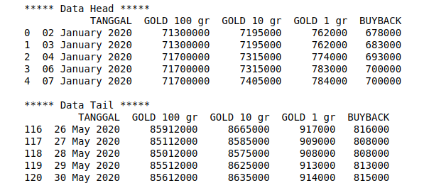
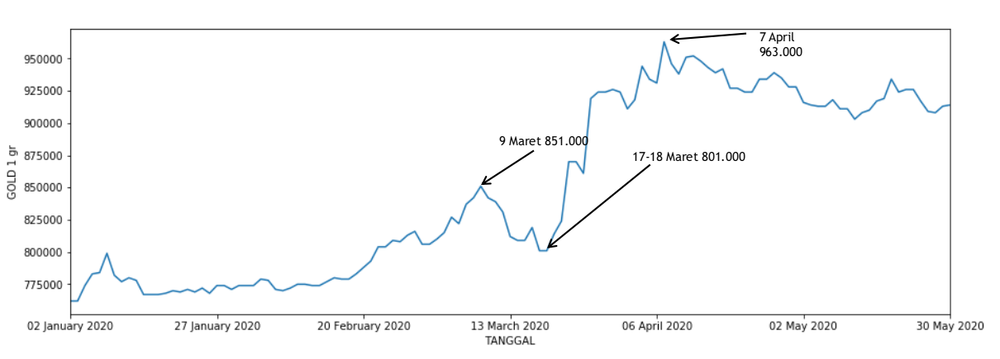
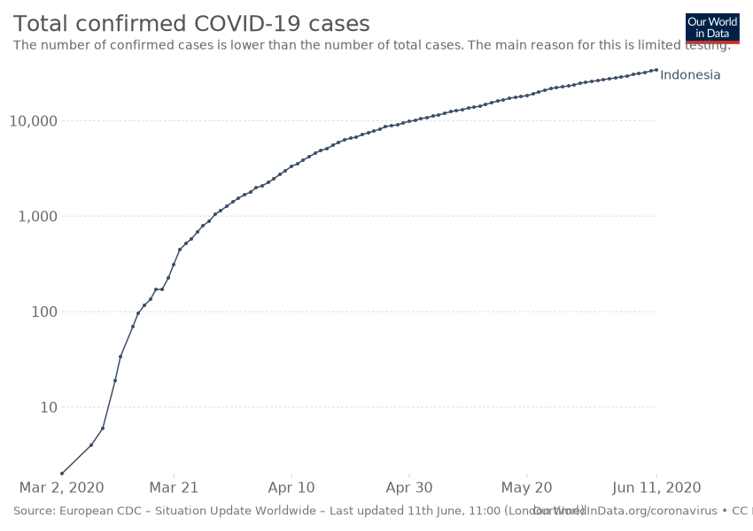
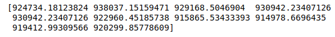

# **#dirumahsaja emas naik**

Emas menjadi salah satu investasi jangka panjang yang relatif stabil atau bisa dibilang risk free sehingga menjadikan emas sebagai investasi yang diminati oleh masyarakat luas.

Harga emas bersifat dinamis, secara umum harganya cenderung naik. Bagi masyarakat yang memilih berinvestasi pada emas tentu saja update berita harga emas menjadi begitu penting termasuk data histori emas yang nanti berperan untuk melakukan prediksi harga kedepan apakah terjadi kenaikan atau penurunan. Adapun faktor yang membuat harga emas bergerak naik ataupun turun yaitu seperti ketidakpastian kondisi global, penawaran dan permintaan emas, kebijakan moneter, inflasi.

Kita akan mencoba mengulas harga emas khusunya di Indonesia dari awal tahun 2020 sampai dengan 30 Mei 2020 yang dimana kondisi Indonesia sendiri sedang terdampak pandemi COVID-19, adanya ketegangan anatara AS - China dan di AS sendiri terjadi kerusuhan. Semua kondisi tadi berpengaruh terhadap pergerakan harga emas.

Dari data harga emas di Indonesia yang diambil dari nexnews.com/harga-emas.htm, pada tanggal 2 Januari 2020 harga emas 1 gram sebesar Rp 762.000 dan pada tanggal 30 Mei 2019 sudah naik menjadi Rp 914.000. Data yang didapat tadi saya visualisasikan dalam bentuk grafik garis.

Dari bulan Januari ada peningkatan harga kemudian menurun dan terdapat harga mulai naik mulai bulan Februari dan puncak kenaikan pada 9 maret 2020 dengan harga jual sebesar 851.000 kemudian setelah itu harga turun kembali hingga pada tanggal 17 - 18 Maret 2020 harga jual emas 1 gram sebesar 801.000. Setelah 18 Maret 2020 harga emas melonjak naik secara signifikan hingga pada puncaknya pada tanggal 7 April 961.000, hal ini menjadi rekor harga emas tertinggi pada tahun 2020. Setelah 7 April harga emas mulai turun hingga di bawah 900.000.

Salah satu penyebab yang mempengaruhi harga emas adalah kondisi global, pada kasus ini faktor kuat yang mempengaruhi harga emas adalah munculnya laporan kasus COVID-19 pertama di Indonesia yakni 2 Maret 2020.

Pada 17 Maret 2020 terdapat total 134 kasus yang terkonfirmasi dan pemerintah mulai menerapkan aturan PSBB disejumlah wilayah, hingga pada 11 Juni 2020 total kasus positif corona meyentuh angka 34.416.

## Apa hubungannya pandemi dengan melonjaknya harga emas?

Meningkatnya kasus positif COVID 19 di seluruh dunia dan khususnya di Indonesia membuat pemerintah menerepakan kebijakan guna menanggulangi dampak dari COVID 19 ini, pemerintah mengajak masyarakat luas untuk di rumah saja termasuk bekerja dari rumah gerakan ini dimasyarakat dikenal dengan gerakan #dirumahsaja.

Gerakan #dirumahsaja tentu membawa dampak besar pada kehidupan seluruh masyarakat, meskipun jual beli sudah bisa dilakukan secara online tetapi ekonomi global cukup tertekan khususnya dibidang pariwisata. Ada banyak hotel, restauran tutup untuk sementara waktu karena tidak adanya penerbangan atau akses transportasi untuk berlibur, karena hotel, restauran, objek wisata tutup sementara tentu permintaan bahan makanan ataupun produk - produk tertentu menjadi turun drastis. Dengan kondisi ekonomi global yang tidak menentu ini banyak investor yang mengalihkan investasinya ke emas yang sifatnya lebih aman dari resiko kerugian.

Dari data sebelumnya kita coba untuk memprediksi harga 10 hari kemudian dengan metode Linier Regresion, didapat data seperti di atas yang jika kita rapikan jadi seperti berikut.

|Hari                |Prediksi Harga                          |Harga Sebenarnya                         |
|----------------|-------------------------------|-----------------------------|
|1 (31 Mei)|924.734|914.000
|2 (01 Jun)|938.037|914.000
|3 (02 Jun)|929.168|920.000
|4 (03 Jun)|930.942|904.000
|5 (04 Jun)|930.942|887.000
|6 (05 Jun)|922.960|887.000
|7 (06 Jun)|915.865|876.000
|8 (07 Jun)|914.978|876.000
|9 (08 Jun)|919.412|876.000
|10 (09 Jun)|920.299|875.000

Ada pergerakan yang dinamis pada harga emas 1 gram jika dilihat harganya cenderung menurun hal ini disebabkan salah satunya adalah prediksi mengenai penemuan vaksin COVID 19 semakin dekat.

Untuk program prediksi ini dapat dilihat [disini](https://github.com/IanNarsa/iannarsa.github.io/blob/master/gold%20predict.ipynb)

Next Article : 
[Analisis Gempa Bersumber Tweet BMKG](https://github.com/IanNarsa/iannarsa.github.io/blob/master/bmkg/bmkg.md)
---------------------------------->