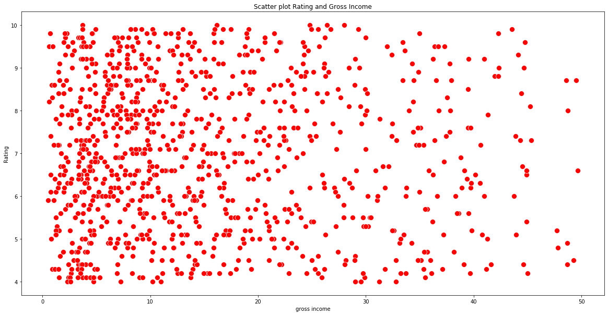
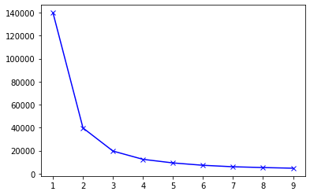
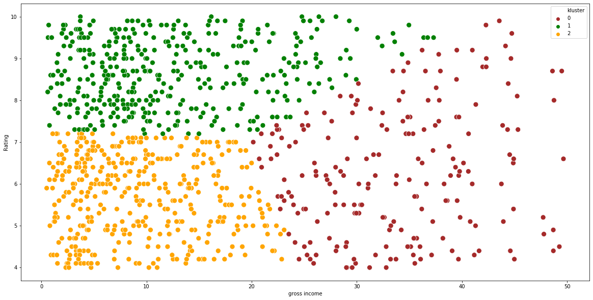
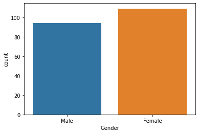
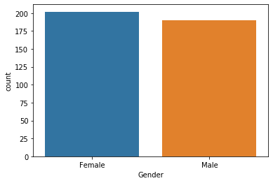
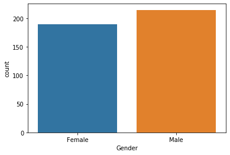

# Klustering penjualan supermarket

Data set ini berisi data penjualan pada supermarket. Data set ini berisi beberapa atribut yang memuat informasi sebagai berikut.

1. Invoice id: id struk pembayaran
2. Branch: cabang supermarket, dalam hal ini terdapat 3 cabang A, B, C
3. City: Location of supercenters
4. Customer type: Jenis konsumen, konsumen yang terdaftar sebagai member atau tidak
5. Gender: Jenis kelamin konsumen
6. Product line: Kategori produk yang dijual - Electronic accessories, Fashion accessories, Food and beverages, Health and beauty, Home and lifestyle, Sports and travel
7. Unit price: Harga produk dalam $
8. Quantity: Jumlah barang yang dijual
9. Tax: pajak sebesar 5% dari pembelian
10. Total: Total harga sudah termasuk pajak
11. Date: Tanggal transaksi
12. Time: Waktu transaksi (10am to 9pm)
13. Payment: Metode pembayaran yang dapat dilakukan oleh konsumen – Cash, Credit card dan Ewallet
14. COGS: Cost of goods sold
15. Gross margin percentage: Gross margin percentage
16. Gross income: Pendapatan kotor
17. Rating: Penilaian konsumen terhadap pengalaman berbelanja pada skala 1-10

|  | Invoice ID | Branch | City | Customer type | Gender | Product line | Unit price | Quantity | Tax 5% | Total | Date | Time | Payment | cogs | gross margin percentage | gross income | Rating |
| --- | --- | --- | --- | --- | --- | --- | --- | --- | --- | --- | --- | --- | --- | --- | --- | --- | --- |
| 0 | 750-67-8428 | A | Yangon | Member | Female | Health and beauty | 74.69 | 7 | 26.1415 | 548.9715 | 1/5/2019 | 13:08 | Ewallet | 522.83 | 4.761905 | 26.1415 | 9.1 |
| 1 | 226-31-3081 | C | Naypyitaw | Normal | Female | Electronic accessories | 15.28 | 5 | 3.8200 | 80.2200 | 3/8/2019 | 10:29 | Cash | 76.40 | 4.761905 | 3.8200 | 9.6 |
| 2 | 631-41-3108 | A | Yangon | Normal | Male | Home and lifestyle | 46.33 | 7 | 16.2155 | 340.5255 | 3/3/2019 | 13:23 | Credit card | 324.31 | 4.761905 | 16.2155 | 7.4 |
| 3 | 123-19-1176 | A | Yangon | Member | Male | Health and beauty | 58.22 | 8 | 23.2880 | 489.0480 | 1/27/2019 | 20:33 | Ewallet | 465.76 | 4.761905 | 23.2880 | 8.4 |
| 4 | 373-73-7910 | A | Yangon | Normal | Male | Sports and travel | 86.31 | 7 | 30.2085 | 634.3785 | 2/8/2019 | 10:37 | Ewallet | 604.17 | 4.761905 | 30.2085 | 5.3 |

Pada dataset tersebut, bahwa supermartket memiliki 3 cabang, cabang A berada di kota Yangon, cabang C berada di kota Naypitaw dan cabang B berada di kota Mandalay. Supermarket juga mengkelompokkan konsumennya mmenjadi dua yaitu member dan normal, konsumen dapat melakukan transaksi melalui Ewallet, Cash maupun Credit card. Supermarkat sendiri menjual enam jenis barang yaitu Health and beauty, Electronic accessories, Home and lifestyle,
 Sports and travel, Food and beverages dan Fashion accessories.

    Daftar Branch :  ['A' 'C' 'B'] 
    
    Daftar Kota :  ['Yangon' 'Naypyitaw' 'Mandalay'] 
    
    Jenis Pelanggan :  ['Member' 'Normal'] 
    
    Jenis Produk :  ['Health and beauty' 'Electronic accessories' 'Home and lifestyle'
     'Sports and travel' 'Food and beverages' 'Fashion accessories'] 
    
    Jenis Pembayaran :  ['Ewallet' 'Cash' 'Credit card'] 
    

Mencari kluster dari data penjualan, disini akan kita cari seperti apa perilaku konsumen dengan memilih dua variabel yaitu gross income dan Rating

    [Text(0.5, 1.0, 'Scatter plot Rating and Gross Income')]

|  | gross income | Rating |
| --- | --- | --- |
| 0 | 26.1415 | 9.1 |
| 1 | 3.8200 | 9.6 |
| 2 | 16.2155 | 7.4 |
| 3 | 23.2880 | 8.4 |
| 4 | 30.2085 | 5.3 |

Mencari Inertias, inertias diperlukan untuk mencari kluster yang tepat.

Dari grafik di atas patahan terjadi pada titik 3, sehingga pembagian kluster yang tepat adalah 3 kluster.

## Hasil cluster

|  | Invoice ID | Branch | City | Customer type | Gender | Product line | Unit price | Quantity | Tax 5% | Total | Date | Time | Payment | cogs | gross margin percentage | gross income | Rating | kluster |
| --- | --- | --- | --- | --- | --- | --- | --- | --- | --- | --- | --- | --- | --- | --- | --- | --- | --- | --- |
| 0 | 750-67-8428 | A | Yangon | Member | Female | Health and beauty | 74.69 | 7 | 26.1415 | 548.9715 | 2019-01-05 | 13:08 | Ewallet | 522.83 | 4.761905 | 26.1415 | 9.1 | 1 |
| 1 | 226-31-3081 | C | Naypyitaw | Normal | Female | Electronic accessories | 15.28 | 5 | 3.8200 | 80.2200 | 2019-03-08 | 10:29 | Cash | 76.40 | 4.761905 | 3.8200 | 9.6 | 1 |
| 2 | 631-41-3108 | A | Yangon | Normal | Male | Home and lifestyle | 46.33 | 7 | 16.2155 | 340.5255 | 2019-03-03 | 13:23 | Credit card | 324.31 | 4.761905 | 16.2155 | 7.4 | 1 |
| 3 | 123-19-1176 | A | Yangon | Member | Male | Health and beauty | 58.22 | 8 | 23.2880 | 489.0480 | 2019-01-27 | 20:33 | Ewallet | 465.76 | 4.761905 | 23.2880 | 8.4 | 1 |
| 4 | 373-73-7910 | A | Yangon | Normal | Male | Sports and travel | 86.31 | 7 | 30.2085 | 634.3785 | 2019-02-08 | 10:37 | Ewallet | 604.17 | 4.761905 | 30.2085 | 5.3 | 0 |

    Index(['Invoice ID', 'Branch', 'City', 'Customer type', 'Gender',
           'Product line', 'Unit price', 'Quantity', 'Tax 5%', 'Total', 'Date',
           'Time', 'Payment', 'cogs', 'gross margin percentage', 'gross income',
           'Rating', 'kluster'],
          dtype='object')

Scatterplot hasil klustering

    <matplotlib.axes._subplots.AxesSubplot at 0x7f4ee9b68588>

### Melihat deskripsi gross income pada setiap kluster

|  | kluster 0 gross income | kluster 1 gross income | kluster 2 gross income |
| --- | --- | --- | --- |
| count | 203.000000 | 392.000000 | 405.000000 |
| mean | 33.501318 | 12.284592 | 9.291460 |
| std | 7.407348 | 8.217227 | 5.895869 |
| min | 20.150000 | 0.604500 | 0.508500 |
| 25% | 27.519500 | 5.985875 | 4.125000 |
| 50% | 33.421500 | 10.162500 | 8.377000 |
| 75% | 39.110000 | 18.277250 | 13.962000 |
| max | 49.650000 | 37.300000 | 23.090000 |

Jika dilihat dari tabel di atas, kluster 0 memiliki rata - rata pendapatan kotor tertinggi yaitu sebesar 33.5 dilanjutkan kluster 1 dengan rata - rata pendapatan kotor sebesar 12.28 dan yang terakhir kluster 2 sebesar 9.2.

|  | kluster 0 Unit price | kluster 1 Unit price | kluster 2 Unit price |
| --- | --- | --- | --- |
| count | 203.000000 | 392.000000 | 405.000000 |
| mean | 81.134384 | 51.377628 | 47.066222 |
| std | 13.689975 | 25.532772 | 24.356520 |
| min | 40.300000 | 10.130000 | 10.080000 |
| 25% | 72.435000 | 30.135000 | 25.560000 |
| 50% | 82.880000 | 50.255000 | 45.350000 |
| 75% | 92.340000 | 72.585000 | 64.970000 |
| max | 99.960000 | 99.830000 | 99.890000 |

### Melihat deskripsi Rating setiap kluster

|  | Rating Kluster 0 | Rating Kluster 1 | Rating Kluster 2 |
| --- | --- | --- | --- |
| count | 203.000000 | 392.000000 | 405.000000 |
| mean | 6.293103 | 8.665306 | 5.675062 |
| std | 1.493733 | 0.793658 | 0.937130 |
| min | 4.000000 | 7.200000 | 4.000000 |
| 25% | 5.100000 | 8.000000 | 4.900000 |
| 50% | 6.200000 | 8.700000 | 5.800000 |
| 75% | 7.400000 | 9.400000 | 6.500000 |
| max | 9.900000 | 10.000000 | 7.200000 |

Untuk rating setiap kluster dapat dilihat pada tabel di atas. Kluster 0 rata - rata memiliki rating 6.2, kluster 1 rata - rata memiliki rating 8.6 dan kluster 2 rata - rata memiliki rating 5.6.
 
 Jika kita lihat, dari tabel sebelumnya pendapatan kotor tertinggi ada pada kluster 0 sebesar 33.5 dan rata - rata rating 6.2 dan apabila kita lihat lagi pada kluster 0 ini juga memiliki rata - rata unit price yang tinggi yaitu sebesar  $81 . 
 
 Sementara untuk rata - rata rating tertinggi yang diberada pada kluster 1 sebesar 8.6 memiliki rata - rata pendapatan kotor 12.28, hal ini jauh di bawah rata - rata pendapatan kluster 0. Yang terakhir kluster 2 dengan rata - rata rating 5.6 dengan rata - rata pendapatan kotor 47.

    Kluster 0
                            Quantity  gross income  Rating
    Product line                                          
    Electronic accessories       283     1115.3560   198.0
    Fashion accessories          269     1079.2110   207.1
    Food and beverages           270     1095.2255   201.0
    Health and beauty            251     1001.5165   201.0
    Home and lifestyle           319     1290.6620   237.2
    Sports and travel            300     1218.7965   233.2 
    
    Kluster 1
                            Quantity  gross income  Rating
    Product line                                          
    Electronic accessories       347      765.0105   557.8
    Fashion accessories          335      860.7085   603.7
    Food and beverages           369      898.9445   666.5
    Health and beauty            333      837.4175   553.2
    Home and lifestyle           327      724.3400   514.9
    Sports and travel            299      729.1390   500.7 
    
    Kluster 2
                            Quantity  gross income  Rating
    Product line                                          
    Electronic accessories       341      707.1350   421.4
    Fashion accessories          298      646.0755   440.4
    Food and beverages           313      679.3940   370.2
    Health and beauty            270      503.6250   310.3
    Home and lifestyle           265      549.8510   341.9
    Sports and travel            321      676.9610   414.2 
    

|  | Unit price | Quantity | Tax 5% | Total | cogs | gross margin percentage | gross income | Rating | kluster |
| --- | --- | --- | --- | --- | --- | --- | --- | --- | --- |
| count | 1000.000 | 1000.000 | 1000.000 | 1000.000 | 1000.000 | 1000.000 | 1000.000 | 1000.000 | 1000.000 |
| mean | 55.672 | 5.510 | 15.379 | 322.967 | 307.587 | 4.762 | 15.379 | 6.973 | 1.202 |
| std | 26.495 | 2.923 | 11.709 | 245.885 | 234.177 | 0.000 | 11.709 | 1.719 | 0.754 |
| min | 10.080 | 1.000 | 0.508 | 10.678 | 10.170 | 4.762 | 0.508 | 4.000 | 0.000 |
| 25% | 32.875 | 3.000 | 5.925 | 124.422 | 118.497 | 4.762 | 5.925 | 5.500 | 1.000 |
| 50% | 55.230 | 5.000 | 12.088 | 253.848 | 241.760 | 4.762 | 12.088 | 7.000 | 1.000 |
| 75% | 77.935 | 8.000 | 22.445 | 471.350 | 448.905 | 4.762 | 22.445 | 8.500 | 2.000 |
| max | 99.960 | 10.000 | 49.650 | 1042.650 | 993.000 | 4.762 | 49.650 | 10.000 | 2.000 |

Melihat kluster 0

    Gender
    Female    109
    Male       94
    Name: kluster, dtype: int64

    Kluster 0 dengan pengkelompokan Gender dan Payment
    Gender  Payment    
    Female  Cash           36
            Credit card    40
            Ewallet        33
    Male    Cash           35
            Credit card    28
            Ewallet        31
    Name: kluster, dtype: int64
    
    Kluster 0 dengan pengkelompokan Gender dan Product line
    Gender  Product line          
    Female  Electronic accessories    16
            Fashion accessories       15
            Food and beverages        21
            Health and beauty         13
            Home and lifestyle        24
            Sports and travel         20
    Male    Electronic accessories    17
            Fashion accessories       17
            Food and beverages        10
            Health and beauty         18
            Home and lifestyle        15
            Sports and travel         17
    Name: kluster, dtype: int64

Melihat kluster 1

    Gender
    Female    202
    Male      190
    Name: kluster, dtype: int64

    Kluster 1 dengan pengkelompokan Gender dan Payment
    Gender  Payment    
    Female  Cash           81
            Credit card    61
            Ewallet        60
    Male    Cash           53
            Credit card    65
            Ewallet        72
    Name: kluster, dtype: int64
    
    Kluster 1 dengan pengkelompokan Gender dan Product line
    Gender  Product line          
    Female  Electronic accessories    31
            Fashion accessories       44
            Food and beverages        41
            Health and beauty         29
            Home and lifestyle        29
            Sports and travel         28
    Male    Electronic accessories    33
            Fashion accessories       25
            Food and beverages        37
            Health and beauty         35
            Home and lifestyle        31
            Sports and travel         29
    Name: kluster, dtype: int64

Melihat kluster 2

    Gender
    Female    190
    Male      215
    Name: kluster, dtype: int64

    Kluster 2 dengan pengkelompokan Gender dan Payment
    Gender  Payment    
    Female  Cash           61
            Credit card    62
            Ewallet        67
    Male    Cash           78
            Credit card    55
            Ewallet        82
    Name: kluster, dtype: int64
    
    Kluster 2 dengan pengkelompokan Gender dan Product line
    Gender  Product line          
    Female  Electronic accessories    37
            Fashion accessories       37
            Food and beverages        28
            Health and beauty         22
            Home and lifestyle        26
            Sports and travel         40
    Male    Electronic accessories    36
            Fashion accessories       40
            Food and beverages        37
            Health and beauty         35
            Home and lifestyle        35
            Sports and travel         32
    Name: kluster, dtype: int64

